# Architecture — SchreckNet

A ground-up rebuild of [VDB](https://github.com/smeea/vdb) (React 19 + Flask + SQLAlchemy)
as an offline-first, WebAssembly-powered app with SQLite as the single storage technology
and MCP as the primary machine API. **Scope: the V5 format only**, card search/research
+ deck building — no tournament or community-data features (TWD/TDA/PDA/playtest
program; see docs/feature-parity.md's scope note). The card pool is the VEKN V5-legal
list, filtered at data-pipeline time (see docs/data.md); all filter options derive
from that pool.

## Guiding decisions (see docs/adr/ for full records)

1. **One Rust core, two targets.** All domain logic lives in the `core/` Rust crate:
   deck parsing/serialization (deck-in-URL, Lackey, JOL), format legality
   validation, draw simulation, deck diff, and proxy layout. It compiles
   to **WebAssembly** for the browser and links natively into the server. One
   implementation, zero drift between client and server behavior.

2. **SQLite everywhere.**
   - *Card database* (`cards.sqlite`): built at CI time from KRCG static files + VEKN
     official card list. Read-only, versioned, shipped to the browser (~a few MB,
     served with long-lived cache headers + content hash).
   - *Browser*: official **SQLite WASM** build with **OPFS** persistence. Card search
     filters compile to SQL over FTS5 + indexed columns → instant, fully offline search.
     Anonymous users' decks/inventory live in a local `user.sqlite` (OPFS).
   - *Server*: the same `cards.sqlite` plus `app.sqlite` (accounts, decks, inventory)
     via `rusqlite`. WAL mode. Litestream-compatible layout for backups.
     Postgres is deliberately **not** in scope "for beginning" — the schema avoids
     SQLite-only features where reasonable to keep the door open.

3. **Frontend: React 19 + TypeScript + Vite + Tailwind CSS 4.** Same family as the
   original (which eases feature-by-feature porting) but strictly typed, with a modern
   design system (see docs/design.md), dark/light themes, and a PWA service worker.

4. **Server: Rust (axum), one binary.** Serves the static frontend, the JSON REST API
   (OpenAPI 3.1 document generated from code), and the **MCP server**.

5. **MCP as the primary machine API.** Model Context Protocol over **Streamable HTTP**
   (current spec revision), plus a stdio transport for local use. REST/OpenAPI remains
   as the compatibility layer for non-MCP clients. See docs/api.md.

6. **Docker via GitHub Actions.** Multi-stage build → single small image (distroless),
   multi-arch (amd64/arm64), pushed to GHCR on main + version tags. The card-data
   pipeline runs as a separate scheduled workflow that rebuilds `cards.sqlite` and opens
   a PR when upstream card data changes.

7. **Semantic search stays local and optional.** A checksum-pinned ONNX sentence
   model generates query embeddings in a browser worker or one lazy native server
   instance; the data build stores normalized card vectors in `cards.sqlite`, and
   shared Rust performs deterministic exact cosine ranking. Model assets load only
   when semantic mode is requested, so exact/regex search keeps its current startup
   and offline profile. Browser, MCP, and REST adapters are live and a checked-in
   Playwright gate enforces reviewed VTES relevance, native/browser top-10 membership
   and material-order parity, size/latency budgets, and a true-offline reload. See
   docs/adr/0006-offline-semantic-card-search.md.

## Language boundary

TypeScript owns presentation and browser integration: React components, routing,
accessibility, OPFS/worker/service-worker coordination, and typed adapters that
marshal values across WASM. It must not decide VTES rules or reproduce behavior
needed by native callers.

Rust `core/` owns deterministic domain behavior. The browser calls it through
`frontend/src/lib/core.ts`; the server links the same crate directly. Current
migration status:

| Domain behavior | Shared Rust status |
| --- | --- |
| Deck legality, text/share formats, diff, statistics | Live in native + WASM |
| Semantic result validation/ranking | Live in native + WASM |
| Opening-hand sizes, seeded shuffle, quantity expansion | Live in native + WASM; MCP + REST mirror |
| Exact-search result sorting | Live in native + WASM through `core/src/search_sort.rs` |
| Exact-search filter normalization and query planning | Live in native + WASM through `core/src/search_plan.rs`; platform adapters only execute plans and map rows |
| Card-text token parsing and structured symbol metadata | Migration pending |

Moving code merely to reduce the TypeScript line count is not a goal. Moving a
rule or deterministic transformation that could drift between browser and server
is required.

## Repository layout

```
/
├── AGENTS.md               # canonical agent instructions (all assistants)
├── CLAUDE.md               # Claude Code entrypoint → AGENTS.md + Claude specifics
├── docs/
│   ├── architecture.md     # this file
│   ├── feature-parity.md   # exhaustive VDB parity checklist (source of truth)
│   ├── data.md             # card data pipeline & SQLite schemas
│   ├── api.md              # MCP tools + REST surface
│   ├── design.md           # design system, mockups reference
│   ├── domain-vtes.md      # VTES rules primer & glossary for agents
│   ├── roadmap.md          # phased milestones
│   └── adr/                # architecture decision records
├── core/                   # Rust crate: domain logic (wasm + native)
├── server/                 # Rust axum binary (REST + MCP + static hosting)
├── frontend/               # React 19 + TS + Vite + Tailwind 4 PWA
├── data/                   # card-data pipeline (KRCG/VEKN → cards.sqlite)
├── models/                 # pinned semantic-model manifest; no binary weights
├── Dockerfile
└── .github/workflows/      # docker.yml, ci.yml, card-data.yml
```

## Runtime topology

```mermaid
flowchart LR
    subgraph Browser [Browser — offline-first PWA]
        UI[React 19 UI]
        WASMCore[core.wasm<br/>deck engine]
        EmbedWorker[Optional semantic worker<br/>local ONNX model]
        SQLW[(SQLite WASM<br/>cards.sqlite + user.sqlite<br/>in OPFS)]
        UI --> WASMCore
        UI --> SQLW
        UI -. semantic query .-> EmbedWorker --> WASMCore
    end

    subgraph Server [server binary — axum]
        Static[static frontend]
        REST[REST · OpenAPI 3.1]
        MCP[MCP · Streamable HTTP]
        NativeCore[core &#40;native&#41;]
        NativeEmbed[Optional local<br/>ONNX embedder]
        DB[(cards.sqlite<br/>app.sqlite)]
        REST --> NativeCore --> DB
        MCP --> NativeCore
        REST -. semantic query .-> NativeEmbed --> NativeCore
        MCP -. semantic query .-> NativeEmbed
    end

    Browser -- "sync: accounts, decks,<br/>inventory" --> REST
    Agents[AI agents / tools] --> MCP
    CI[GitHub Actions<br/>card-data pipeline] -- "cards.sqlite" --> Server
```



Search, deck building, stats, draw simulation, diff, proxy generation and format
validation all run **client-side** (WASM + SQLite WASM) and keep working offline.
The server is only needed for accounts, cross-device sync, and the machine APIs.

## Key flows

- **Card search**: filter UI state → platform SQL adapter → local SQLite → results.
  Browser/server filter planning is the largest remaining Rust-core migration;
  until it is centralized, golden composition tests guard the two implementations.
- **Semantic card search**: structured filters select candidates → the
  local platform adapter embeds the query with the pinned ONNX model → shared
  native/WASM Rust ranks normalized vectors loaded from `cards.sqlite`. Browser and
  server return the same top-k set and materially separated order within the
  documented numeric tolerance.
- **Deck edit (logged in)**: optimistic local write (OPFS) → sync mutation to REST →
  conflict resolution by revision counter (decks carry a monotonically increasing rev;
  branches are first-class rows, mirroring vdb's branch feature).
- **Anonymous deck sharing**: `core/` encodes the deck into a compact URL-safe string
  (same idea as vdb's deck-in-URL), so decks are shareable without accounts.

## Security & legal

- Auth: username + password (argon2id), optional email for reset — parity with vdb;
  passkeys (WebAuthn) as a modern additive option. Session cookies (HttpOnly, SameSite).
- Rate limiting on auth + write endpoints (tower middleware).
- Card images & names © Paradox Interactive AB, used under the **Dark Pack** agreement;
  the required notice appears in the app footer and README. Code is MIT.
